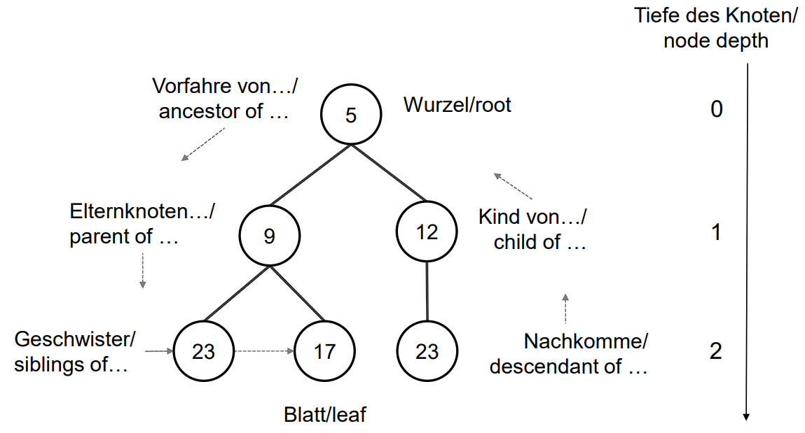

# Datenstrukturen

## Definition

Eine Datenstruktur ist eine Methode, Daten für den Zugriff und die Modifikation zu organisieren.

## Abstrakte Datentypen vs Datenstrukturen

Abstrakte Datentypen (ADTs) sind näher an der Anwendung während Datenstrukturen näher an der Maschine sind. 
Im Allgemeinen gilt, dass ADTs das *"was"* beschreiben, während Datenstrukturen das *"wie"* beschreiben.

## Stack

Funktioniert nach dem last-in-first-out Prinzip.

### Operationen

- `new(Stack)`
Erzeugt neuen Stack
- `isEmpty(Stack)`
Prüft ob der Stack leer ist 
- `pop(Stack)`
Gibt oberstes Element vom Stack zurück löscht es vom Stack (`Exception`, wenn Stack leer)
- `push(Stack, value)`
Fügt den Wert `value` als neues oberstes Element vom Stack hinzu (`Exception`, wenn Stack voll)

### Herausforderungen

Bei einfacher Feldarbeit wird von einer festen Größe ausgegangen. Das führt zu einer Laufzeit von $\Omega(n)$ pro Kopiervorgang. Um dies zu reduzieren, wird "unendlich" viel Speicher für die Stacks reserviert.

### Lösung

Wenn Grenze erreicht, verdopple Speicher und kopiere um. Schrumpfe und kopiere um, wenn weniger als $1/4$ des Stacks belegt. Damit liegt die Laufzeit im Schnitt bei $\Theta(1)$.

### Beispiel

Sei ein Stack `S` wie folgt initialisiert: 

\tilerow{3,5,4,}

&nbsp;

**Operationen auf** `S`:

\begin{tabular}{lll}
    1) & \texttt{pop(S)} & \tilerow{3,5,,} \\
    \\[-0.7em]
    2) & \texttt{pop(S)} & \tilerow{3,,,} \\
    \\[-0.7em]
    3) & \texttt{push(S,1)} & \tilerow{3,1,,} \\
    \\[-0.7em]
    4) & \texttt{push(S,7)} & \tilerow{3,1,7,} \\
\end{tabular}

## Queues

Funktioniert nach dem first-in-first-out Prinzip.

### Operationen

- `new(Queue)`
Erzeugt neue Queue
- `isEmpty(Queue)`
Prüft ob die Queue leer ist
- `dequeue(Queue)`
Gibt vorderstes Element der Queue zurück und entfernt es
(`Exception`, wenn Queue leer)
- `enqueue(Queue, value)`
Fügt den Wert `value` als neues hinterstes Element der Queue hinzu (`Exception`, wenn Queue voll)

### Beispiel

Sei eine Queue `Q` wie folgt initialisiert: 

\tilerow{1,2,5,}

&nbsp;

**Operationen auf** `Q`:

\begin{tabular}{lll}
    1) & \texttt{dequeue(Q)} & \tilerow{,2,5,} \\
    \\[-0.7em]
    2) & \texttt{enqueue(Q,3)} & \tilerow{,2,5,3} \\
    \\[-0.7em]
    3) & \texttt{enqueue(Q,4)} & \tilerow{4,2,5,3} \\
    \\[-0.7em]
    4) & \texttt{dequeue(Q)} & \tilerow{4,,5,3} \\
\end{tabular}

## Verkettete Listen

### Aufbau

Jede Liste verfügt über einen Kopf, auch `head` genannt. Dieser zeigt auf das erste Element der List.

Jedes der einzelnen Elemente verfügt über folgende Attribute:

- `key`: Wert
- `prev`: Zeigt auf Vorgänger (bzw. `nil`)
- `next`: Zeigt auf Nachfolger (bzw. `nil`)

## Einfach verkettete Listen

Es wird wenig Speicherplatz benötigt, da nur der Zeiger zum Nachfolger gespeichert werden muss. 
Außerdem ist das einfügen eines neuen Elements durch die einfache Verkettung mit weniger Aufwand verbunden.

### Algorithmen

```
reverseList(L):
    a=L.head;
    b=a.next;
    a.next=nil;
    WHILE b != nil DO
        t=b.next;
        b.next=a;
        a=b;
        b=t;
        L.head=a;
```
**Laufzeit**: $O(n)$  

## Doppelt verkettete Listen

Die Liste kann sowohl vorwärts als auch rückwärts durchlaufen werden.
Das Löschen eines Elementes befindet sich - wenn der Zeiger auf dem zu löschenden Element ist - in $O(1)$.

### Algorithmen

\begin{minipage}[t]{0.7\linewidth}
\vspace{0pt}
```
search(L,k):
    current=L.head;
    WHILE current != nil AND current.key != k DO
        current=current.next;
    return current;
```
\textbf{Laufzeit}: $\Theta (n)$
\end{minipage}
\begin{minipage}[t]{0.3\linewidth}
\vspace{0pt}
```
insert(L,x):
    x.next=L.head;
    x.prev=nil;
    IF L.head != nil THEN
        L.head.prev=x;
    L.head=x;
```
\textbf{Laufzeit}: $\Theta (1)$
\end{minipage}

&nbsp;

\begin{minipage}[t]{0.5\linewidth}
\vspace{0pt}
```
delete(L,x):
    IF x.prev != nil THEN
        x.prev.next=x.next
    ELSE
        L.head=x.next;
    IF x.next != nil THEN
        x.next.prev=x.prev;
```
\textbf{Laufzeit}: $\Theta (1)$
\end{minipage}
\begin{minipage}[t]{0.5\linewidth}
\vspace{0pt}
```
deleteSent(L,x):
    x.prev.next=x.next;
    x.next.prev=x.prev;
```
\textbf{Laufzeit}: $\Theta (1)$  
\end{minipage}

## Binärer Baum

### Begrifflichkeiten

{ width=70% }

### Algorithmen

\begin{minipage}[t]{0.5\linewidth}
\vspace{0pt}
```
search(x,k):
    IF x==nil THEN 
        return nil;
    IF x.key==k THEN 
        return x;
    y=search(x.left,k);
    IF y != nil THEN 
        return y;
    return search(x.right,k);
```
\textbf{Laufzeit}: $\Theta (n)$  
\end{minipage}
\begin{minipage}[t]{0.5\linewidth}
\vspace{0pt}
```insert(T,x):
    IF T.root != nil THEN
        T.root.parent=x;
        x.left=T.root;
    T.root=x;
```
\textbf{Laufzeit}: $\Theta (1)$
\newline
\newline
\textbf{Vorgehen}: \texttt{x} wird die neue Wurzel und die vorherige Wurzel wird linkes Kind von \texttt{x}
\end{minipage}

&nbsp;

\begin{minipage}[t]{0.5\linewidth}
\vspace{0pt}
```
transplant(T,y,w):
    v=y.parent;
    IF y != T.root THEN
        IF y == v.right THEN
            v.right=w;
        ELSE
            v.left=w;
    ELSE
        T.root=w;
    IF w != nil THEN
        w.parent=v;
```
\textbf{Laufzeit}: $\Theta (1)$  
\end{minipage}
\begin{minipage}[t]{0.5\linewidth}
\vspace{0pt}
```
delete(T,x):
    y=T.rooz; 
    WHILE y.right!=nil DO
        y=y.right;
    transplant(T,y,y.left);
    IF x != y THEN 
        y.left=x.left;
        IF x.left != nil THEN
            x.left.parent=y;
        y.right=x.right;
        IF x.right != nil THEN
            x.right.parent=y;
        transplant(T,x,y);
```
\textbf{Laufzeit}: $\Theta (h)$, wobei h Höhe des Baumes
\newline
\newline
\textbf{Vorgehen}: 
\newline 
Nehme rechtesten Knoten von Wurzel \texttt{r}, verbinde Kinder von \texttt{r} mit \texttt{r.parent} und ersetze \texttt{x} durch \texttt{r}.
\end{minipage}

&nbsp;

## Binärer Suchbaum

### Algorithmen

\begin{minipage}[t]{0.5\linewidth}
\vspace{0pt}
```
search(x,k):
    // 1.Aufruf x=root

    IF x==nil OR x.key==k THEN
        return x;
    IF x.key > k THEN
        return search(x.left,k)
    ELSE
        return search(x.right,k);
```
\textbf{Laufzeit}: $\Theta (h)$, wobei h Höhe des Baumes  
\end{minipage}
\begin{minipage}[t]{0.5\linewidth}
\vspace{0pt}
```
iterative-search(x,k):
    // Aufruf x=root

    WHILE x != nil AND x.key != k DO
        IF x.key > k THEN
            x=x.left
        ELSE
            x=x.right;
    return x;
```
\textbf{Laufzeit}: $\Theta (h)$, wobei h Höhe des Baumes  
\end{minipage}

&nbsp;

\begin{minipage}[t]{0.5\linewidth}
\vspace{0pt}
```
insert(T,z):
    // may insert z again
    // z.left==z.right==nul;
    
    x=T.root; px=nil;

    WHILE x != nil DO
        px=x;
        IF x.key > z.key THEN
            x=x.left
        ELSE
            x=x.right;
    z.parent=px;
    IF px==nil THEN 
        T.root=z
    ELSE
        IF px.key > z.key THEN
            px.left=z
        ELSE
            px.right=z;
```
\textbf{Laufzeit}: $\Theta (h)$, wobei h Höhe des Baumes  
\end{minipage}
\begin{minipage}[t]{0.5\linewidth}
\vspace{0pt}
```
transplant(T,u,v):
    IF u.parent==nil THEN
        T.root=v
    ELSE
        IF u==u.parent.left THEN
            u.parent.left=v
        ELSE
            u.parent.right=v;
    IF v != nil THEN
        v.parent=u.parent;
```
\textbf{Laufzeit}: $\Theta (1)$
\end{minipage}

&nbsp;

\begin{minipage}[t]{0.5\linewidth}
\vspace{0pt}
```
delete(T,z):
    IF z.left==nil THEN
        transplant(T,z,z.right)
    ELSE
        IF z.right==nil THEN
            transplant(T,z,z.left)
        ELSE
            y=z.right;
            WHILE y.left != nil DO
                y=y.left;
            IF y.parent != z THEN
                transplant(T,y,y.right);
                y.right=z.right;
                y.right.parent=y;
            transplant(T,z,y);
            y.left=z.left;
            y.left.parent=y;
```
\textbf{Laufzeit}: $O(h)$ 
\end{minipage}
\begin{minipage}[t]{0.5\linewidth}
\vspace{0pt}
\textbf{Vorgehen}:

\begin{enumerate}
\item Knoten \texttt{z} hat nur ein Kind: Ersetze \texttt{z} durch sein Kind.
\item Knoten \texttt{z} ist ein Blatt: Knoten \texttt{z} löschen.
\item Knoten \texttt{z} hat zwei Kinder:
    \begin{enumerate}
        \item \texttt{z.right} hat kein linkes Kind: \texttt{z} durch \texttt{z.right} ersetzen
        \item Andernfalls: Ersetze \texttt{y}, den linkesten Knoten von \texttt{z.right}, durch \texttt{y.right} und \texttt{z} durch \texttt{y}.
    \end{enumerate}
\end{enumerate}
\end{minipage}

### Beispiel

Der binären Suchbaum mit $BS=\{14,24,20,23,21,22\}$, sieht wie folgt aus:

{ width=90% }

\newpage
