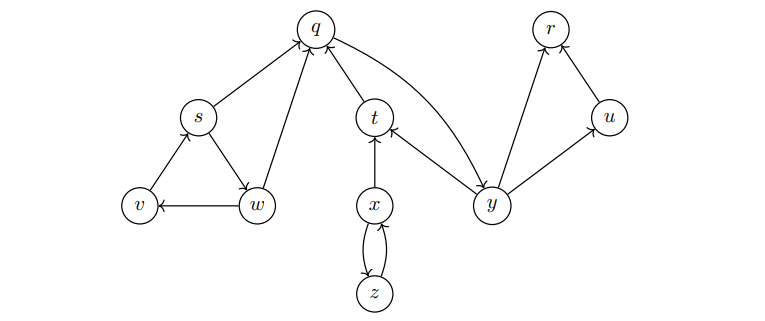

# Graphen Algorithmen

## Adjunkte Matrix

`adj(G,u)` enspricht der Liste aller Knoten $v \in V$ mit $(u,v) \in E$ für $G=(V,E)$, wobei die Reihenfolge irrelevant ist.

### Beispiel

\begin{tikzpicture}[auto, node distance=3cm, every loop/.style={},
                    thick,main node/.style={circle,draw,font=\normalsize}]
    \node[main node] (1) {A};
    \node[main node] (2) [right of=1] {B};
    \node[main node] (3) [right of=2] {C};
    \node[main node] (4) [below of=1] {D};
    \node[main node] (5) [below of=2] {E};

    \draw (1) -- (2);
    \draw (1) -- (4);
    \draw (2) -- (3);
    \draw (2) -- (4);
    \draw (3) -- (5);
    \draw (4) -- (5);
\end{tikzpicture}
    
$\texttt{adj(G,A)}=\begin{bmatrix}
    0 \\
    1 \\
    0 \\
    1 \\
    0
\end{bmatrix},
~\cdots,
~\texttt{adj(G,E)}=\begin{bmatrix}
    0 \\
    0 \\
    1 \\
    1 \\
    0
\end{bmatrix}$

## Graphen

### Math. Schreibweise

**Knoten**: $V=\{v_1, v_2, ..., v_n\}$

**Kanten**: $E=\{(x,y)\in V \times V)\}$

**Graph**: $G=(V,E)$

### Definitionen

#### Gewichteter Graph

Ist ein Graph, welcher Kantengewichte hat. Die Kantengewichte sind die Kosten, welche bei einer Transition von Knoten $x$ zu Knoten $y$ anfallen.

#### Gerichteter Graph

Verfügt über Pfeile, welche die Richtung angeben. Somit ist eine Kante nicht mehr bidirektional.

#### Azyklischer Graph

Ein gerichteter Graph ist dann azyklisch, wenn es keine gerichteten Zyklen gibt, wobei ein gerichteter Zyklus eine Sequenz von Knoten ist, bei der man von einem Knoten zu einem anderen entlang der gerichteten Kanten gehen kann und schließlich zu dem ursprünglichen Knoten zurückkehrt. Genau dann ist er auch **topologisch**.

#### Zusammenhängend

Wenn jeder Knoten im ungerichteten Graphen von jedem anderen Knoten aus erreichbar ist, wird ein Graph **zusammenhängend** genannt.

#### Stark zusammenhängend

Wenn jeder Knoten im gerichteten Graphen von jedem anderen Knoten erreichbar ist, wird ein Graph **stark zusammenhängend** genannt.

#### Subgraphen

Wenn ein Graph $G'$ selber ein Graph ist und eine Teilmenge der Knoten und Kanten von Graph $G$ enthält, wird Graph $G'$ **Subgraph** von $G$ genannt.

### Topologische Sortierung

Damit ein Graph topologisch sortierbar ist, muss er gerichtet sein.

Sei ein Graph $S$ gegeben durch

\begin{tikzpicture}[auto, node distance=2cm, every loop/.style={},
                        thick,main node/.style={circle,draw,font=\small}]
    \node[main node] (1) {A};
    \node[main node] (2) [right of=1] {B};
    \node[main node] (3) [right of=2] {C};
    \node[main node] (4) [right of=3] {D};
    \node[main node] (5) [below of=1] {E};
    \node[main node] (6) [below of=2] {F};
    \node[main node] (7) [below of=3] {G};
    \node[main node] (8) [below of=4] {H};

    \draw[->] (1) -- (2);
    \draw[->] (1) -- (5);
    \draw[->] (2) -- (3);
    \draw[->] (2) -- (5);
    \draw[->] (4) -- (3);
    \draw[->] (4) -- (8);
    \draw[->] (5) -- (3);
    \draw[->] (5) -- (6);
    \draw[->] (6) -- (4);
    \draw[->] (7) -- (4);
    \draw[->] (7) -- (6);
    \draw[->] (7) -- (8);
\end{tikzpicture}

Eine mögliche topologische Sortierung für den Graph $S$ lautet dann $G \rightarrow A \rightarrow B \rightarrow E \rightarrow F \rightarrow D \rightarrow H \rightarrow C$. Diese betrachtet die *Finishing Time* der einzelnen Knoten bei angewendeter Tiefensuche.

### Graphen und Bäume

Graph $G=(V,E)$ ist ein Baum, wenn $V$ leer ist oder es einen Knoten $r \in V$ ("Wurzel") gibt, so dass jeder Knoten $v$ von der Wurzel aus per eindeutigem Pfad erreichbar ist.

### Darstellung als Matrix
Für einen Graphen $G=(V,E)$ wobei 
$$V=\{1,2,3,4,5,6\}$$ 
$$E=\{(1,4),(1,5),(2,1),(2,2),(4,2),(5,6),(6,4)\}$$ 
gilt, sieht die Matrix wie folgt aus:<>

$A=\begin{bmatrix}
    0 & 0 & 0 & 1 & 1 & 0 \\
    1 & 1 & 0 & 0 & 0 & 0 \\
    0 & 0 & 0 & 0 & 0 & 0 \\
    0 & 1 & 0 & 0 & 0 & 0 \\
    0 & 0 & 0 & 0 & 0 & 1 \\
    0 & 0 & 0 & 1 & 0 & 0
\end{bmatrix}$

(siehe adjunkte Matrix

### Starke Zusammenhangskomponenten

Eine starke Zusammenhangskomponente eines gerichteten Graphen $G=(V,E)$ ist eine Knotenmenge $C \subseteq V$, so dass

(a) es zwischen je zwei Knoten $u,v \in C$ einen Pfad von $u$ nach $v$ gibt, und 
(b) es keine Menge $D \subseteq V$ mit $C \subsetneq D$ gibt, für die (a) auch gilt

{ max-width="min(15rem, 90%)"}

## Breadth-First Search (BFS)

### Definition

Besuche zuerst alle unmittelbaren Nachbarn, danach deren Nachbarn, usw.

### Anwendung

- Webcrawling
- Broadcasting
- ...

### Algorithmen

```
BFS(G,s):
    FOREACH u in V-{s} DO
        u.color=WHITE; 
        u.dist=+$infty; 
        u.pred=nil;
    s.color=GRAY; s.dist=0; s.pred=nil; 
    newQueue(Q);
    enqueue(Q,s);
    WHILE !isEmpty(Q) DO
        u=dequeue(Q);
        FOREACH v in adj(G,u) DO
            IF v.color==WHITE THEN
                v.color=GRAY; 
                v.dist=u.dist+1; 
                v.pred=u; 
                enqueue(Q,v);
        u.color=BLACK;
```
**Laufzeit**: $O(|V|+|E|)$

```
SHORTEST-PATH(G,s,v):
    IF v==s THEN
        return s
    ELSE
        IF v.pred==nil THEN
            return nil
        ELSE
            SHORTEST-PATH(G,s,v.pred);
            return v;
```
**Laufzeit**: $O(|V|)$

### Korrektheit

Sei $G=(V,E)$ gerichteter oder ungerichteter Graph mit Knoten $s \in V$. Dann gilt nach Terminierung von $BFS(G,s)$ für jeden von $s$ aus erreichbaren Knoten $v$, dass $shortest(s,v)=v.dist$. 

Für $v \neq s$ ist ein kürzester Pfad durch einen kürzesten Pfad von $s$ nach $v.pred$ und der Kante $(v.pred,v)$ gegeben.

### Abgeleiteter BFS-Baum

$G^{s}_{pred}$ ist BFS-Baum zu $G$, 
d.h. enthält alle von $s$ aus erreichbaren Knoten in $G$ und für jeden Knoten $v \in V^{s}_{pred}$ existiert genau ein Pfad von $s$ in $G^{s}_{pred}$, der auch ein kürzester Pfad von $s$ zu $v$ in $G$ ist.

### Beispiel

{ width=80% }

{ width=50% } { width=20rem }

## Depth-First Search (DFS)

Besuche zuerst alle noch nicht besuchten Nachfolgeknoten ("Laufe so weit wie möglich weg von aktuellem Knoten")

### Algorithmen

```
DFS(G):
    // G=(V,E)

    FOREACH u in V DO
        u.color=WHITE; 
        u.pred=nil;
    time=0; 
    FOREACH u in V DO
        IF u.color==WHITE THEN
            DFS-VISIT(G,u)
```
**Laufzeit**: $O(|V|+|E|)$

```
DFS-VISIT(G,u):
    time=time+1;
    u.disc=time;
    u.color=GRAY;
    FOREACH v in adj(G,u) DO
        IF v.color==WHITE THEN
            v.pred=u;
            DFS-VISIT(G,v);
    u.color=BLACK;
    time=time+1;
    u.finish=time;
```

### Beispiel

Erste Ausführung von DFS:

{ width=50% } { width=20rem }

Zweite Ausführung von DFS mit umgekehrten Kanten:

{ width=50% } { width=20rem }

Somit sind die Zusammenhangskomponenten:

{ width=20rem }

### Kanten

Es sei definiert, dass $G_\text{pred} = (V, E_\text{pred})$ von $G$ mit
$$E_\text{pred} = \{ (v.\text{pred},v) ~ | ~ v \in V , v.\text{pred} \neq \text{NIL} \}$$

(und $v$, $v.\text{pred}$ für ungerichtete Graphen) 

#### Vorgehen

Führe DFS auf dem Graphen G aus und trage nach dem untenstehenden Bedingungen Kanten in zugehörige Kantenart ein.

#### Baumkante

- Alle Kanten in $G_{pred}$
- **Bedingung**: `v.color==WHITE`

#### Vorwärtskante

- Alle Kanten in $G$ zu Nachkommen in $G_{pred}$, die nicht Baumkante
- **Bedingung**: `v.color==GRAY`

#### Rückwärtskante

- Alle Kanten in $G$ zu Vorfahren in $G_{pred}$, die nicht Baumkante (inkl. Schleifen)
- **Bedingung**: `v.color==BLACK and u.disc<v.disc`

#### Kreuzkante

- Alle anderen Kanten in $G$
- **Bedingung**: `v.color==BLACK and v.disc<u.disc`

## Minimaler Spannbaum (MST)

### Definition

Für einen zusammenhängenden, ungerichteten, gewichteten Graphen $G=(V,E)$ mit Gewichten $w$ ist der Subgraph $T=(V,E_T)$ von $G$ ein **Spannbaum** ("spanning tree"), wenn $T$ azyklisch ist und alle Knoten verbindet. 

Der Spannbaum ist **minimal**, wenn 

$$w(T)= \sum_{\{u,v\} \in E_T}{w(\{u,v\})}$$

minimal für alle Spannbäume von $G$ ist.

### Terminologie

{ width=80% }

- **Schnitt** partitioniert Knoten des Graphen in zwei Mengen
    - Hier: $S=\{4,5\}$ und $S=\{1,2,3\}$

- **überbrückender Schnitt**, wenn $u \in S$ und $v \in V-S$
    - Hier: Kanten $\{2,5\}$ und $\{2,4\}$, wobei $\{2,5\}$ eine **leichte** Kante ist

- **Schnitt respektiert $A \subseteq E$**, wenn keine Kante $\{u,v\}$ aus **$A$** den Schnitt überbrückt

### Beispiel

{ width=30% }

### Generic-Algorithmus

```
genericMST(G,w):
    A=$emptySet
    WHILE A does not form a spanning tree for G DO
        find safe edge {u,v} for A
        A = A + {{u,v}}
    return A
```


#### Terminierung

Da es in jeder Iteration eine sichere Kante für $A$ gibt (sofern $A$ noch kein Spannbaum), terminiert die Schleife nach maximal $|E|$ Iterationen.

#### Korrektheit

Da in jeder Iteration nur sichere Kanten hinzugefügt werden (für die $A \cup \{\{u,v\}\}$ noch Teilmenge eines MST ist), ist am Ende der `WHILE`-Schleife $A$ ein MST.

### Prim-Algorithmus

**Idee**: Algorithmus fügt, beginnend mit Wurzelknoten, immer leichte Kante zu zusammenhängender Menge hinzu

#### Vorgehen

1. **Start:**
    - Wähle einen Knoten aus dem Graphen.
    - Erstelle einen neuen Graphen mit diesem Startknoten.
2. **Kanten hinzufügen:**
    - Wähle die Kante mit den geringsten Kosten, die einen neuen Knoten mit dem aktuellen Graphen verbindet.
    - Füge diese Kante zum neuen Graphen hinzu.
    - Wiederhole diesen Schritt, bis alle Knoten im neuen Graphen abgebildet sind.
3. **Minimaler Spannbaum:**
    - Entferne überflüssige Kanten aus dem ursprünglichen Graphen.
    - Der resultierende Graph ist der minimale Spannbaum.

#### Algorithmus

```
MST-Prim(G,w,r):
    // r root in V, MST given through v.pred values

    FOREACH v in V DO {v.key=$infty; v.pred=nil;}
    r.key=-$\infty$; Q=V;
    WHILE !isEmpty(Q) DO
        u=EXTRACT-MIN(Q); // smallest key value
        FOREACH v in adj(u) DO
            IF v in Q and w({u,v}) < v.key THEN
                v.key=w({u,v}); 
                v.pred=u;
```
**Laufzeit**: $O(E+|V| \cdot \log{|V|})$

{ width=35% } { max-width="min(40rem, 90%)"}


### Kruskal-Algorithmus

**Idee**: Zu jedem Knoten $V$ sei $set(v)$ Menge von mit $v$ durch $A$ verbundenen Knoten. Zu Beginn ist $set(v)=\{v\}$.

#### Vorgehen

1. **Start:**
    - Sortiere alle Kanten aufsteigend nach ihren Kantengewichten.
    - Erstelle einen neuen Graphen ohne Kanten.
1. **Kanten hinzufügen:**
    - Füge nacheinander die aufsteigend sortierten Kanten hinzu.
    - Achte darauf, keine Kanten einzufügen, die Kreise bilden würden.
1. **Minimaler Spannbaum:**
    - Stoppe, wenn alle Knoten im minimalen Spannbaum enthalten sind.

#### Algorithmus

```
MST-Kruskal(G,w):
    A=$emptySet
    FOREACH v in V DO set(v)={v};
    Sort edges according to weight in nondecreasing order
    FOREACH {u,v} in E according to order DO
        IF set(u)!=set(v) THEN
            A = A + {{u,v}}
            UNION(G,u,v);
    return A
```
**Laufzeit**: $O(|E|+\log{|V|})$

**Laufzeit mit Optimierung**: $O(|E|+\log{|E|})$

{ max-height=15rem } { width=80%, max-width="min(35rem, 90%)"}

### Sichere Kante

Sei $A$ Teilmenge eines MST, $(S,V-S)$ Schnitt, der $A$ respektiert, und $\{u,v\}$ eine leichte Kante, die den Schnitt überbrückt.
Dann ist $\{u, v\}$ sicher für $A$.

## Single-Source Shortest Path (SSSP)

### Algorithmen

```
relax(G,u,v,w):
    IF v.dist > u.dist + w((u,v)) THEN
        v.dist=u.dist + w((u,v));
        v.pred=u;
```
**Idee**: Verringere aktuelle Distanz von Knoten $v$, wenn durch Kante {(u, v)} kürzere Distanz erreichbar. 

```
initSSSP(G,s,w):
    FOREACH v in V DO
        v.dist=$infty;
        v.pred=nil;
    s.dist=0;
```

### Bellman-Ford

Der Bellman-Ford-Algorithmus löst das Problem, den kürzesten Weg von einem Startknoten zu allen anderen Knoten in einem kantengewichteten Graphen zu finden. Er kann auch mit negativen Kantengewichten umgehen, solange es keine negativen Zyklen gibt.

#### Vorgehen

1. Starte an einem beliebigen Knoten im Graphen.
1. Setze die Distanz zu jedem Knoten auf $\infty$, außer zum Startknoten (dort auf $0$).
1. Überprüfe jede Kante, um den günstigsten Weg zu finden:
    - Wenn die Kosten zum Ausgangsknoten plus die Kantenkosten geringer sind als die bisher bekannten Kosten zum Zielknoten, aktualisiere die Distanz.
1. Wiederhole Schritt 3 für alle Knoten.

**Wichtig:** Achte darauf, Zyklen mit negativem Gewicht auszuschließen.

#### Algorithmus

```
Bellman-Ford-SSSP(G,s,w):
    initSSSP(G,s,w);
    FOR i=1 TO |V|-1 DO
        FOREACH (u,v) in E DO
            relax(G,u,v,w);
    FOREACH (u,v) in E DO
        IF v.dist > u.dist+w((u,v)) THEN
            return false;
    return true;
```

**Laufzeit**: $O(|V| \cdot |E|)$

### Dags

#### Algorithmus

```
TopoSort-SSSP(G,s,w):
    // G dag

    initSSSP(G,s,w);
    execute topological sorting
    FOREACH u in V in topological order DO
        FOREACH v in adj(u) DO
            relax(G,u,v,w)
```
**Laufzeit**: $O(|V| + |E|)$

### Dijkstra

#### Vorgehen

1. Weise allen Knoten die Eigenschaften "Distanz" und "Vorgänger" zu.
1. Initialisiere die Distanz im Startknoten mit $0$ und in allen anderen Knoten mit $\infty$.
1. Solange es noch unbesuchte Knoten gibt:
    - Wähle denjenigen mit minimaler aufsummierten Distanz aus und markiere ihn als besucht.
    - Berechne für alle noch unbesuchten Nachbarknoten die Gesamtdistanz über das Kantengewicht und die bisherige Distanz zum aktuellen Knoten.
    - Aktualisiere die aufsummierte Distanz, wenn der neue Wert kleiner ist.
1. Fortsetzen, bis die Distanz zum Zielknoten berechnet wurde (single-pair shortest path) oder die Distanzen aller Knoten zum Startknoten bekannt sind (single-source shortest path).

#### Algorithmus

```
Dijkstra-SSSP(G,s,w):
    initSSSP(G,s,w);
    Q=V; // let S=V-Q
    WHILE !isEmpty(Q) DO
        u=EXTRACT-MIN(Q); // wrt. dist
        FOREACH v in adj(u) DO
            relax(G,u,v,w);
```

**Hinweis**: Funktioniert **nicht** mit negativen Kantengewichten.

**Laufzeit**: $O(|V| \cdot \log{|V|} + |E|)$

### A*

#### Vorgehen

#### Algorithmus

```
A*(G,s,t,w):
    init(G,s,t,w);
    Q=V; // let S=V-Q
    WHILE !isEmpty(Q) DO
        u=EXTRACT-MIN(Q);
        IF u==t THEN break; // Hinzugefuegt im Vergleich zu Dijkstra
        FOREACH v in adj(u) DO
            relax(G,u,v,w);
```

**Laufzeit**: $O(|V| \cdot \log{|V|} + |E|)$

## Netzwerkflüsse

**Idee**: Kanten haben sowohl einen aktuellen Flusswert, als auch eine maximale Kapazität. Das ist z.B. besonders wichtig in der Datenübertragung über das Internet.

Es gilt $|E| \geq |V|-1$

### Flussnetzwerk

Ein **Flussnetzwerk** ist ein gewichteter, gerichteter Graph $G=(V,E)$ mit Kapazität(-sgewicht) $c$, so dass $c(u,v) \geq 0$ für $(u,v) \in E$ und $c(u,v)=0$ für $(u,v) \notin E$, mit zwei Knoten $s,t \in V$ (Quelle und Senke), so dass jeder Knoten von $s$ aus erreichbar ist und $t$ von jedem Knoten aus erreichbar ist.

#### Fluss 

Ein **Fluss** $f:V \times V \rightarrow \mathbb{R}$ für ein Flussnetzwerk $G=(V,E)$ mit Kapazität $c$, Quelle $s$ und Senke $t$ erfüllt $0 \leq f(u,v) \leq c(u,v)$ für alle $u,v \in V$, sowie für alle $u \in V-\{s,t\}$:

$$\sum_{v \in V}{f(u,v)}= \sum_{v \in V}{f(v,u)}$$

#### Maximale Flüsse

Der **Wert $|f|$ eines Flusses** $f:V \times V \rightarrow \mathbb{R}$ für ein Flussnetzwerk $G=(V,E)$ mit Quelle $s$ und Senke $t$ ist

$$|f|=\sum_{v \in V}{f(s,v)}-\sum_{v \in V}{f(v,s)}$$

### Ford-Fulkerson

**Idee**: Suche Pfad von Quelle $s$ nach Senke $t$, der noch erweiterbar (bzgl. des Flusses) ist

#### Restkapazität

$$c_f(u,v)=\begin{cases}
    c(u,v) - f(u,v) & \text{falls} ~ (u,v) \in E \\
    f(v,u)          & \text{falls} ~ (v,u) \in E \\
    0               & \text{sonst}
\end{cases}$$

#### Restkapazitäts-Graph

$G_f=(V,E_f) ~ \text{mit} ~ E_f=\{(u,v)\in V \times V ~|~c_f(u,v)>0\}$

{ max-width="min(30rem, 90%)"}

#### Vorgehen

1. **Initialisierung**:
    - Starte mit einem zulässigen Fluss (z.B. Nullfluss).
    - Erstelle den Restkapazitäten-Graph basierend auf den Kapazitäten der Kanten im Netzwerk.
1. **Suche nach erweiterbaren Pfaden**:
    - Finde einen Pfad von der Quelle $s$ zur Senke $t$ im Restkapazitäten-Graph $G_f$.
    - Ein Pfad ist "erweiterbar", wenn er noch ungenutzte Kapazität aufweist.
1. **Aktualisiere den Restkapazitäten-Graph**:
    - Erhöhe (für Kanten in $G$) bzw. erniedrige (für Nicht-Kanten) um Minimum $c_f(u,v)$ aller Werte auf dem Pfad in $G$.
1. **Wiederhole Schritte 2-4**:
    - Suche nach weiteren erweiterbaren Pfaden im aktualisierten Restkapazitäten-Graph.
    - Führe die Flussänderungen durch, bis kein erweiterbarer Pfad mehr gefunden werden kann.

#### Algorithmus

```
Ford-Fulkerson(G,s,t,c):
    FOREACH e in E DO e.flow=0;
    WHILE there is path p from s to t in G_flow DO
        c_flow(p) = min(c_flow(u,v) | (u,v) in P)
        FOREACH e in p DO
            IF e in E THEN
                e.flow=e.flow + c_flow(p)
            ELSE
                e.flow=e.flow - c_flow(p)
```
**Laufzeit mit Edmonds-Karb Verbesserung**: $O(|V| \cdot |E|^2)$

**Laufzeit mit maximalem Fluss $f^*$**: $O(|E| \cdot u \cdot |f^*|)$


#### Beispiel
FolgendesBeispiel verwendet zur Pfadsuche DFS und wählt immer den kleinsten Knoten zuerst bzw. Knoten $t$ vor allen anderen Knoten.

{ width=25% }

{ width=85% }

### Max-Flow Min-Cut Theorem

Sei $f: V \times V \rightarrow \mathbb{R}$ Fluss für ein Flussnetzwerk $G=(V,E)$ mit Kapazität $c$, Quelle $s$ und Senke $t$. Dann sind äquivalent:

1. $f$ ist ein maximaler Fluss für $G$
2. Der Restkapazitätsgraph $G_f$ enthält keinen erweiterbaren Pfad
3. $|f| = \min{(c(S,V-S))}$ mit $s \in S$ und $t \in V-S$,

wobei $c(S,V-S) = \sum_{u \in S}{\sum_{v \in V-S}{c(u,v)}}$ für $s \in S$ und $t \in V-S$ die **Kapazität eines Schnitts $(S,V-S)$** ist.
