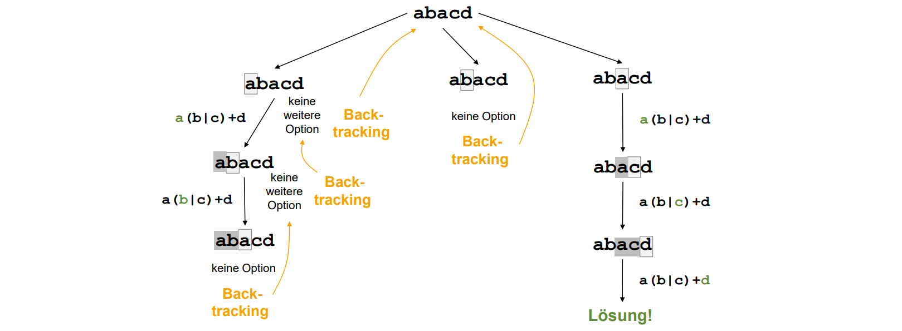

# Advanced Design

## Amortisierte Analyse

Eine amortisierte Analyse wird durchgeführt, um ein besseres Verständnis der durchschnittlichen Kosten von Operationen über eine Sequenz hinweg zu erhalten.

## Divide and Conquer (FFT)

**Idee der Fourier-Transformation**: Ein Problem wird in eine andere Darstellung transformiert, dort gelöst und dann zurücktransformiert. Dies reduziert die Gesamtzeit erheblich.

### Koeffizientendarstellung

Die Koeffizientendarstellung ist in folgender Form:

$$p(x)=p_0+p_1x+p_2x^2+\cdots+p_{n-2}x^{n-2}+p_{n-1}x^{n-1}$$

mit $p_{n-1} \neq 0$ und $grad(p(x))=n-1$.

Eine schnellen Auswertung an Stelle `w` bei Koeffizientendarstellung ist durch die Horner-Methode möglich:

$$p(x)=(((p_{n-1}x+p_{n-2})x+p_{n-3}) \cdots p_1)x+p_0$$

Der Code dazu sieht wiefolgt aus:

```
PolyEval(p,n,w):
    // p[] array of n entries

    y=p[n-1];
    FOR i=n-2 DOWNTO 0 DO y=y*w+p[i];
    return y;
```
**Laufzeit**: $\Theta (n)$

&nbsp;

#### Polynommultiplikation

Durch die Verwendung der Fourier-Transformation kann die Multiplikation von Polynomen effizienter durchgeführt werden.

Für eine Multiplikation zweier Polynome $p(x), q(x)$, beide vom Grad $n-1$ wird folgende Formel verwendet:
\begin{flalign*}
    p(x) \cdot q(x) &= \left(\sum_{i=1}^{n-1}{p_ix^i}\right) \cdot \left(\sum_{i=1}^{n-1}{q_ix^i}\right) ~~ \text{vom Grad} ~ 2n-2 & \\
                    &= \sum_{k=0}^{2n-2}{\left(\sum_{j=0}^{k}{p_j \cdot q_{k-j}}\right)x^k} ~~ \text{"Konvolution"} &
\end{flalign*}

Als Algorithmus sieht das ganze wie folgt aus:

```
PolyMult(p,q,n):
    // p,q arrays of n entries

    r=ALLOC(2n-1);
    FOR k=0 TO 2n-2 DO
        r[k]=0;
        FOR j=0 TO k DO r[k]=r[k]+p[j]*q[k-j];
    return r;
```
**Laufzeit**: $\Theta(\sum_{k=0}^{2n-2}{k})=\Theta (n^2)$

### Punkt/Wert-Darstellung

Die Punkt/Wert-Darstellung ist eindeutig. Somit lässt sich jedes Polynom $p(x)$ über Körper vom Grad $\leq n-1$ eindeutig durch $n$ Punkt/Wert-Paare $(x_j,y_j)_{j=0,...,n-1}$ für verschiedene $x_j$ durch $y_j=p(x_j)$ beschreiben.

Das Ziel hinter der Darstellung ist die vereinfachte Berechnung des Produkts 
$$r(x)=p(x) \cdot q(x)$$

**Hinweis**: Polynom-Multiplikation in Punkt/Wert-Darstellung ist einfach, sofern $x$-Koordinaten $x_0,x_1,x_2...$ für $p$ und $q$ gleich sind: $r(x_j)=p(x_j) \cdot q(x_j)$ für alle $j=0,1,...,2n-2$

Die Multiplikation von Polynomen findet hier durch diesen Algorithmus statt.

```
PolyMult(p,q,n):
    // p,q arrays of 2n-1 entries x,y
    // p[i].x=q[i].x for all i

    r=ALLOC(2n-1);
    FOR i=0 TO 2n-2 DO
        r[i].x = p[i].x;
        r[i].y = p[i].y * q[i].y;
    return r;
```
**Laufzeit**: $\Theta (n)$

Somit zeigt sich, dass die Berechnung hier wesentlich effizienter ist. Die Laufzeit beträgt hier für die Berechnung des Polynomprodukts $\Theta(n)$ im Vergleich zu $\Theta(n^2)$ in der Koeffizientendarstellung.

### $m$-te primitive Einheitswurzel

Eine $m$-te primitive Einheitswurzel $\omega_m$ über einem Körper erfüllt $\omega_m^m=1$ und $\omega_m^i \neq 1$ für $i=1,2,...,m-1$.

#### Beispiel

$$\omega_m=\exp{\left(\frac{2\pi i}{m}\right)}=\cos{\frac{2\pi}{m}}+i \cdot \sin{\frac{2\pi}{m}}$$

#### Regel

Für $m$-te primitive Einheitswurzel $\omega_m$ gilt für gerades $m$

$$\left(\omega_m^i\right)^2=\omega_{m}^{2i} \cdot 1=\omega_{m}^{2i} \cdot \omega_{m}^{m}=\omega_{m}^{2i+m}=\left(\omega_m^{i+m/2}\right)^2$$
für alle $i=0,1,...,\frac{m}{2}-1$.

Ferner ist $\omega_m^2$ eine $\frac{m}{2}$-te primitive Einheitswurzel, da $\left(\omega_m^2\right)^{m/2}=\omega_m^m=1$ und $\left(\omega_m^2\right)^i=\omega_m^{2i}\neq 1$ für $i=1,2,...,\frac{m}{2}-1$ (und somit $2i=2,4,...,m-2$)


### DFT

1. Multiplikation von $p(x)$, $q(x)$ vom Grad $n-1$ in Koeffizientendarstellung
1. Darstellung von $p(x)$, $q(x)$ vom Grad $n-1$ in Punkt/Wert-Darstellung

#### Wofür?

Wir benötigen $2n-1$ Punkt/Werte-Paare. Die Auswertung des Polynoms nach Horner-Methode kostet jeweils $\Theta(n)$ Schritte für jeden Punkt $x_i$. Der Gesamtaufwand für alle $2n-1$ Punkte läge dann bei $\Theta(n^2)$!

#### Berechnung

1. Schreibe $p(x)$ in folgende Form ($n$ gerade): 

    - $p(x) = p_{\text{even}}(x^2)+x \cdot p_{\text{odd}}(x^2)$ mit 
    \begin{flalign*} 
        p_{\text{even}}(x)  &= (p_0+p_2x+...+p_{n-2}x^{(n-2)/2}) & \\ 
        p_{\text{odd}}(x)   &= (p_1+p_3x+...+p_{n-1}x^{(n-2)/2}) &
    \end{flalign*}

1. Verwende Werte $x_j$, so dass $x_j^2=x_{j+n}^2$ für alle $j=0,1,...,n-1$.
1. Dann müssen $p_{\text{even}}, p_{\text{odd}}$ vom Grad $\frac{n-2}{2}=\frac{n}{2}-1$ nur an $n$ Stellen $x_0^2,x_1^2,...,x_{n-1}^2$ ausgewertet werden.

Damit wurde die Problemgröße halbiert und somit ist Divide and Conquer anwendbar.

#### Algorithmen

&nbsp;

```
FFTWrap(p,n):
    // n=2^k =entries in p, k>=0

    return FFT(p,n,w); // w 2n-th primitive root of unity
```

```
FFT(p,n,w):
    // n=2^k =entries in p, k>=0

    pEven=ALLOC(n/2); pOdd=ALLOC(n/2); 
    pVal=ALLOC(2n); pEvenVal=ALLOC(n); pOddVal=ALLOC(n); 
    x=ALLOC(2n); x[0]=1; 
    FOR i=1 TO 2n-1 DO x[i]=w*x[i-1]; // x[i]= w^i

    IF n==1 THEN // constant polynom
        pVal[0].x=x[0]; pVal[0].y=p[0].y;
        pVal[1].x=x[1]; pVal[1].y=p[0].y;
    ELSE
        FOR i=0 TO (n-2)/2 DO
            pEven[i]=p[2i]; pOdd[i]=p[2i+1];
        pEvenVal=FFT(pEven,n/2,w*w);
        pOddVal =FFT(pOdd,n/2,w*w);
        FOR i=0 TO 2n-1 DO 
            pVal[i].x = x[i];
            pVal[i].y=pEvenVal[i mod n].y + x[i]*pOddVal[i mod n].y;
    return pVal;
```
**Laufzeit**: $\Theta(n\log{n})$

### IDFT

1. $r(x)=p(x) \cdot q(x)$ vom Grad $2n-2$ in Punkt/Wert-Darstellung
2. $r(x)=p(x) \cdot q(x)$ vom Grad $2n-2$ in Koeffizientendarstellung

#### Berechnung

Es gilt $V^{-1}=(\frac{\omega^{-ij}}{m})_{ij}$, denn:
\begin{flalign*}
    V^{-1} \cdot V  &= \frac{1}{m} \cdot 
    \begin{pmatrix} 
        1 & \omega_m^{-i} & \omega_m^{-2i} & \cdots &\omega_m^{-(m-1)i}
    \end{pmatrix} \cdot \begin{pmatrix} 
        1 \\
        \omega_m^{j} \\
        \omega_m^{2j} \\
        \vdots \\
        \omega_m^{j(m-1)} 
    \end{pmatrix} & \\
                    &= \frac{1}{m} \cdot \sum_{k=0}^{m-1}{\omega_m^{(-i+j)k}}=\begin{cases}
                        1 & \text{für} ~ i=j \\
                        0 & \text{für} ~ i \neq j, 0 \leq i,j < m
                    \end{cases} &
\end{flalign*}

\newpage

#### Algorithmen

&nbsp;

```
IFFTWrap(rVal,n):
    // n=2^k =entries in rVal, k>=0

    // w n-th primitive root of unity
    r[]=IFFT(rVal,n,w);
    FOR i=0 TO n-1 DO r[i]=r[i]/n;
    return r;
```

```
IFFT(rVal,n,w) 
    // n=2^k =entries in rVal, k>=0

    r=ALLOC(n); rEvenVal=ALLOC(n); rOddVal=ALLOC(n); 
    x=ALLOC(n); x[0]=1; 
    FOR i=1 TO n-1 DO x[i]=w*x[i-1]; // x[i]= w^i
    IF n==1 THEN
        r[0]=rVal[0].y;
    ELSE
        rEven=ALLOC(n/2); rOdd=ALLOC(n/2);
        FOR i=0 TO (n-2)/2 DO
            rEvenVal[i]=rVal[2i]; rOddVal[i]=rVal[2i+1];
        rEven=IFFT(rEvenVal,n/2,w*w); 
        rOdd =IFFT(rOddVal,n/2,w*w);
        FOR i=0 TO n-1 DO
            r[i] =( rEven[i mod n/2] + rOdd[i mod n/2]/x[i] );
    return r;
```
**Laufzeit**: $\Theta(n\log{n})$

### Beispiel

Ergänzen Sie die folgende Tabelle zum Aufruf von FFT für das Polynom $x+2x^2+3x^3$.

{ width=80% }

## Backtracking

### Defintion

Finde Lösungen $x=(x_1,x_2,...,x_n)$ per "Trial-and-Error", indem Teillösung $x_1,x_2,...,x_{i-1}$ durch Kandidaten $x_i$ ergänzt wird, bis Gesamtlösung erhalten, oder bis festgestellt, dass keine Gesamtlösung erreichbar, und Kandidat $x_{i-1}$ revidiert wird.

#### In einfachen Worten

Probiere alle Möglichkeiten aus, um am Ende zur Gesamtlösung zu kommen. Dafür ist es wichtig bei keiner Lösung eine Ebene zurück zu gehen und eine andere Möglichkeit auf dieser Ebene auszuprobieren.

### Aufwand

Der Aufwand kann je nach Problem exponentiell werden



### Backtracking vs DFS

Backtracking kann man als Tiefensuche auf Rekursionsbaum betrachten,
wobei aussichtslose Lösungen evtl. frühzeitig abgeschnitten werden

### Backtracking vs Brute-Force Search

Backtracking kann man als "intelligentere" erschöpfende Suche ansehen, die aussichtslose Lösungen vorher aussortiert

## Dynamisches Programmieren

- Teile Problem in (überlappende) Teilprobleme 
- Löse rekursiv Teilprobleme, verwende dabei Zwischenergebnisse wieder ("Memoization")
- Rekonstruiere Gesamtlösung

### Fibonacci mit Memoization

Speichert sich die Werte vom Vor-Vorgänger, muss demzufolge weniger Berechnungen durchführen und erspart damit womöglich viel Zeit aber vor allem Leistung.

{ width=50% }

### Minimum Edit Distance - Levenshtein-Distanz

Misst Ähnlichkeit von Texten. Wird u.a. bei Google in der Textkorrektur verwendet.

#### Algorithmen

- `ins(S,i,b)`: Fügt an `i`-ter Position Buchstabe `b` in String `S` ein
- `del(S,i)`: Löscht an `i`-ter Position Buchstabe in String `S`
- `sub(S,i,b)`: Ersetzt an `i`-ter Position in String `S` den Buchstaben durch `b`

```
MinEditDist(X,Y,m,n):
    // X=X[1...m], Y=Y[1...n]

    D[][]=ALLOC(m,n);
    FOR i=0 TO m DO D[i][0]=i;
    FOR j=0 TO n DO D[0][j]=j;
    FOR i=1 TO m DO 
        FOR j=1 TO n DO
            IF X[i]=Y[j] THEN s=0 ELSE s=1;
            D[i][j]=min{D[i-1][j-1]+s,D[i-1][j]+1,D[i][j-1]+1};
    return D[m][n];
```

**Laufzeit**: $\Omega(mn)$

Siehe Abbildung \ref{fig:minimum-edit-distance}


## Greedy Algorithmen

Greedy-Algorithmen sind in der Informatik einfache Entscheidungsmethoden, bei denen immer die aktuell beste Option ausgewählt wird, ohne spätere Konsequenzen zu berücksichtigen. Sie sind schnell, aber nicht immer optimal. [Dijkstra-SSSP](#dijkstra) und [MST-Kruskal](#kruskal-algorithmus) sind z.B. solche Algorithmen.

**Genauer**: Finde Lösung $x=(x_1,x_2,...,x_n)$ indem Teillösung $x_1,x_2,...,x_{i-1}$ durch Kandidaten $x_i$ ergänzt wird, der lokal am günstigsten erscheint.

### Dijkstra Algorithmus

Der Algorithmus funktioniert zwar oft, manchmal ist er aber zu "gierig". Ein Beispiel dafür ist folgendes:

{ width=30% }

Hierbei wäre der kosteneffizienteste Weg $1\rightarrow 2 \rightarrow 4 \rightarrow 3 \rightarrow 5$ mit Gewicht $6+2-5+0=3$. Allerdings wählt der Dijkstra Algorithmus den Weg $1 \rightarrow 5$ mit Gewicht $5$. (Abbildung \ref{fig:dijkstra-limitation})

Siehe Abschnitte [Dijkstra](#dijkstra).

### Traveling Salesperson Problem (TSP)

Gegeben vollständiger (un-)gerichteter Graph $G=(V,E)$ mit Kantengewichten $w:E \rightarrow \mathbb{R}$, finde Tour $p$ mit minimalem Kantengewicht $w(p)$.

Eine Tour ist ein Weg $p=(v_0,v_1,...,v_{n-1},v_n)$ entlang der Kanten $(v_i,v_{i+1}) \in E$ für $i=0,1,2,...,{n-1}$, der bis auf Start- und Endknoten $v_0=v_n$ jeden Knoten genau einmal besucht ($V=\{v_0,v_1,...,v_{n-1}\}$).

## Heuristiken

Dedizierter Suchalgorithmus für Optimierungsproblem, der gute (aber evtl. nicht optimale) Lösung für spezielles Problem findet

## Metaheuristiken

Allgemeine Vorgehensweise, um Suche für beliebige Optimierungsprobleme zu leiten

### Hill-Climbing-Algorithmus

```
HillClimbing(P):
    sol=initialSol(P);
    time=0;
    WHILE time<maxTime DO
        new=perturb(P,sol);
        IF quality(P,new)>quality(P,sol) THEN
            sol=new;
        time=time+1;
    return sol;
```

### Simulated Annealing

```
SimulatedAnnealing(P):
    sol=initialSol(P);
    time=0;
    WHILE time<maxTime DO
        new=perturb(P,sol);
        temperature=TempSched[time];
        d=quality(P,new)-quality(P,sol); r=random(0,1);
        IF d>0 OR r=<exp(d/temperature) THEN
            sol=new;
        time=time+1;
    return sol;
```

### Tabu Search

- Ausgehend von aktueller Lösung, suche bessere Lösung in der Nähe
- Speichere ein Zeit lang schon besuchte Lösungen, und vermeide diese Lösungen
- Wenn keine bessere Lösung in der Nähe, akzeptiere auch schlechtere Lösung

### Evolutionäre Algorithmen

- Beginne mit Lösungspopulation 
- Wähle beste Lösungen zur Reproduktion aus
- Bilde durch Überkreuzungen und Mutationen der besten Lösungen
neue Lösungen
- Ersetze schlechteste Lösungen durch diese neue Lösungen

\newpage
